# El Mercado
Proyecto Desarrollo Web Entorno Servidor

# Introducción
Ampliación de mi aplicación web para el mercado municipal, he pasado la aplicación al Modelo Vista Controlador y he añadido un perfil de usuario nuevo, el de vendedor. 
Para proximas ampliaciones me gustaría añadirle comentarios y pedidos a los puestos y un tercer usuario que administre los usuarios y la aplicación por completo.
Para poder acceder a la web tenemos este usuario de prueba: 
**Usuario vendedor: cyntigr@gmail.com 
Contraseña: 12345** 
**Usuario Cliente: vera@gmail.com 
Contraseña: 12345** 
He añadido la Api otra vez pero he implementado que se pueda solicitar la apiKey desde el perfil: 
* Api vendedor: 'buenasPuedeProbarLaApi' 

* Si se pone la dirección con la apiKey te devuelve información de todos los puestos: 
https://mercadomunicipal.000webhostapp.com//index.php?con=api&op=infoGlobal&apiKey=buenasPuedeProbarLaApi 

* Si en cambio pones la dirección de la api con el parámetro de id, nos devuelve información de un puesto concreto: https://mercadomunicipal.000webhostapp.com/index.php?con=api&op=infoPuesto&apiKey=buenasPuedeProbarLaApi&id=20 

* Y la última operación consulta la información del usuario, si le mandas el parámetro de idUsuario relleno:
https://mercadomunicipal.000webhostapp.com/index.php?con=api&op=infoUsuario&apiKey=buenasPuedeProbarLaApi&idUsu=si 

**Cintia García Ruiz**  
**2º Desarrollo de Aplicaciones Web** 

## Página Index
En esta página podemos elegir iniciar sesión y que nos aparezca los campos ocultos que tenemos para loguearnos
o registro y nos redirige a la página de registro:

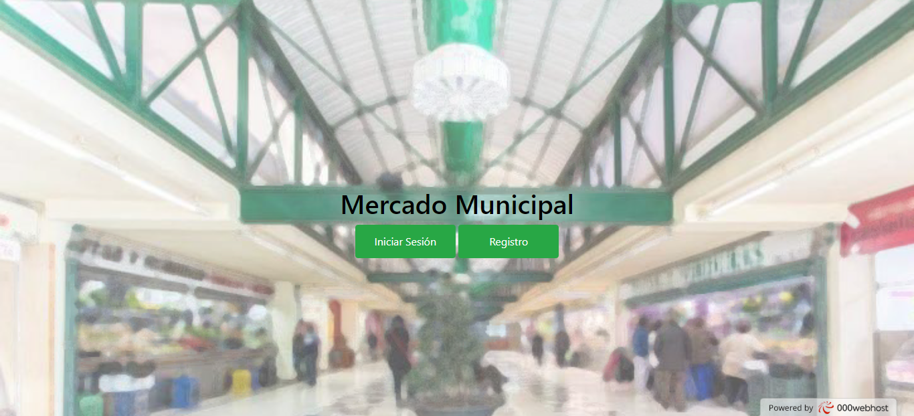 
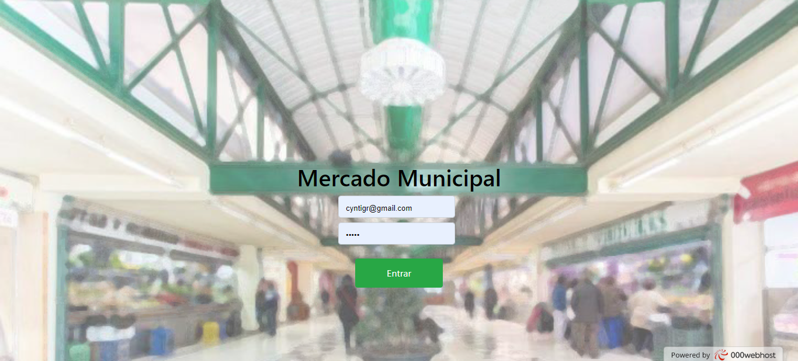 

## Página Registro
Aquí nos podemos registrar como un nuevo usuario; Si no ponemos una imagen de usuario por defecto se añade una foto de un avatar para que no quede vacia, desde la base de datos se comprueba que el email es unico(añadiendo el campo como clave unica) para que no haya dos iguales registrados ya que la clave primaria es autoincremental y podrían haber insertado dos email iguales, en esta nueva versión he añadido un radio para elegir si eres vendedor o un cliente, eso no quiere decir que tengas los privilegios de vendedor, el administrador tendría que validar los datos una vez verificada la identidad:

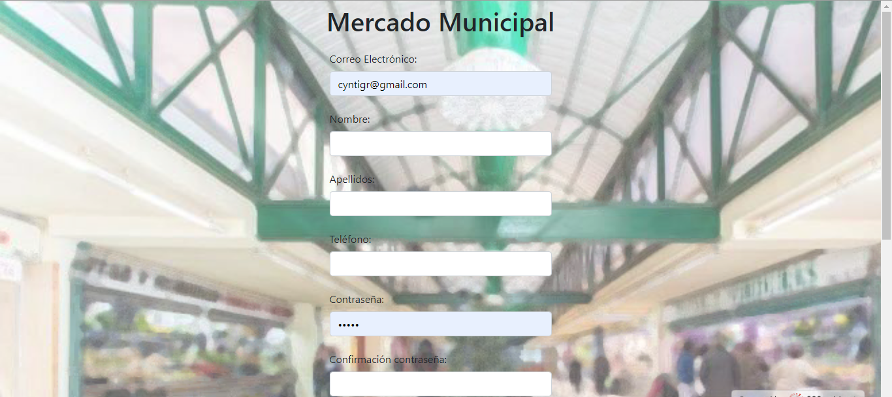 
 

## Página Inicio
Desde esta página visualizamos todos los puestos que tenemos en la base de datos, si es vendedor nos aparecera un enlace más en el navbar indicandonos Mis Puestos, desde este podemos acceder a ellos como veras en la segunda captura:

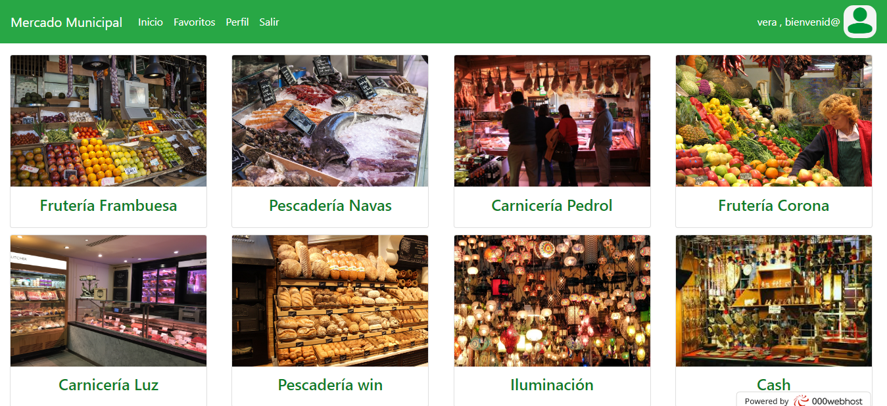 
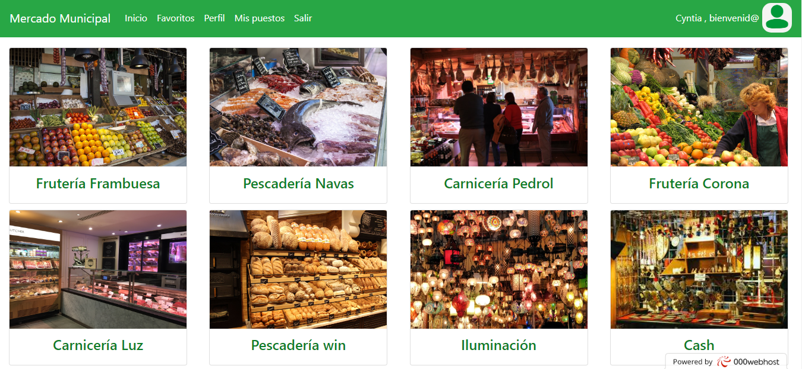 

## Página Información
En esta página podemos ver la información de un puesto en concreto, visualizamos la imagen del puesto, el nombre y el teléfono. También al final aparecen dos botones para añadir ese puesto a tu apartado de favoritos o eliminarlo:

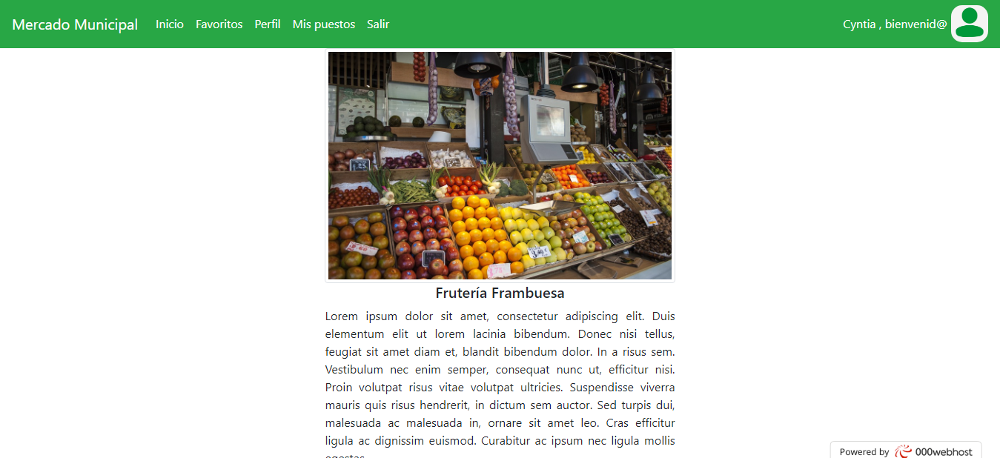 

* Favoritos
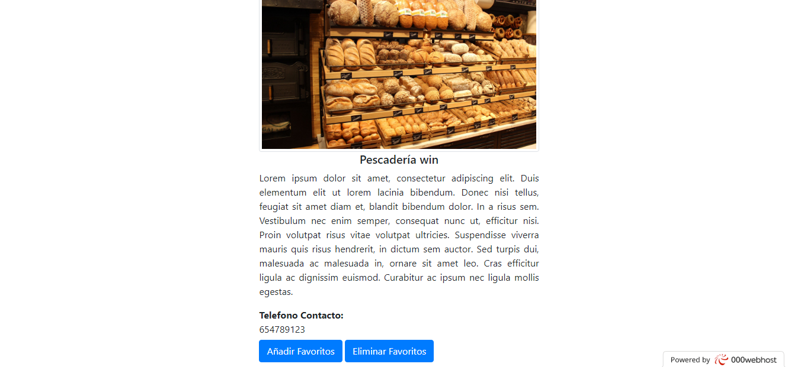 
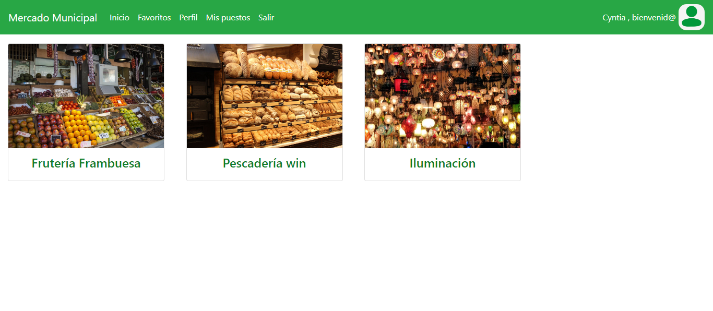 

## Página Perfil
Desde el apartado del perfil podemos modificar los datos de ese usuario, cambiar la imagen... 
En el caso de que el usuario se quiera dar de baja aparece una ventana modal para poder confirmar que se quiere dar de baja, y esta versión también he puesto un texto aclaratorio con el fin de indicar que se borraran todos los datos si decide borrar la cuenta.
También he añadido un botón desde el cual el usuario puede solicitar su ApiKey y al momento aparece en un input desactivado para poder utilizarla cuando quiera. 
Para las modificaciones tendremos mensajes que nos indiquen si se han guardado los datos correctamente o si ha habido algun error: 

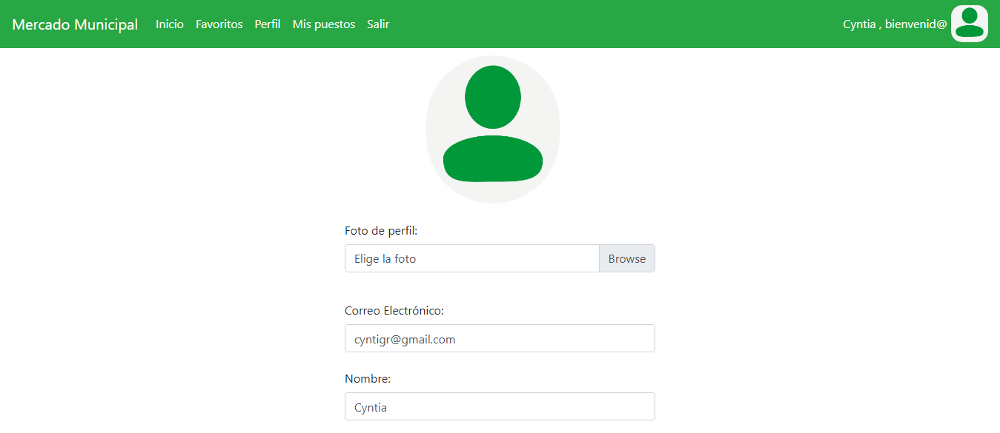 
 

* Modal y mensajes
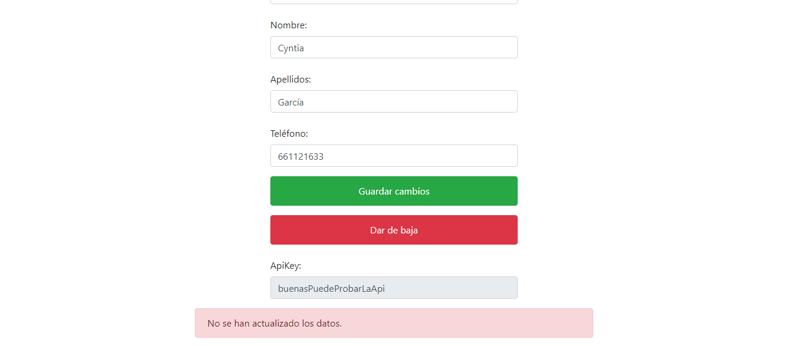 
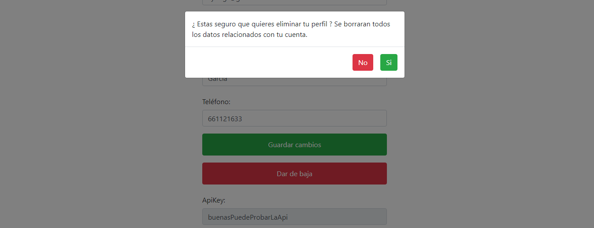 

## Página Puestos
En esta sección nueva de la web podemos añadir nuevos puestos, editarlos y borrarlos. Para acceder aquí es necesario tener las credenciales de tipo vendedor:

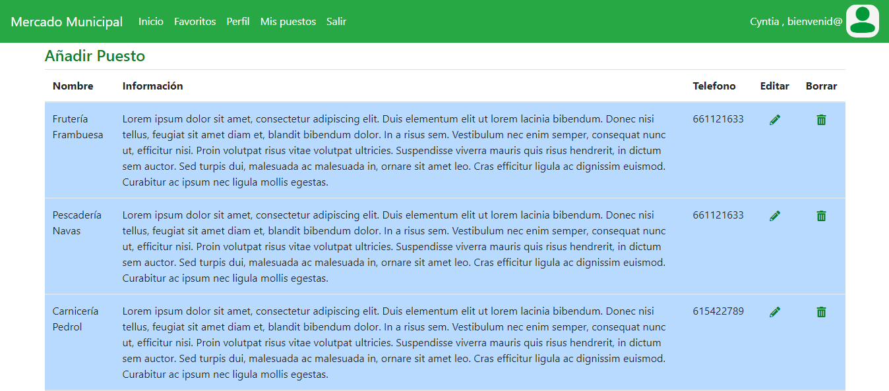 
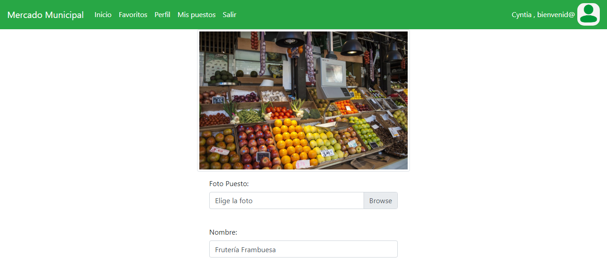 
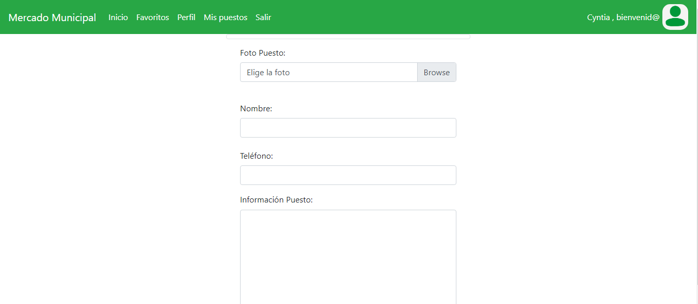 

## Base de datos
Modelo Entidad-Relación de mi proyecto , más las tablas y relaciones en la base de datos:

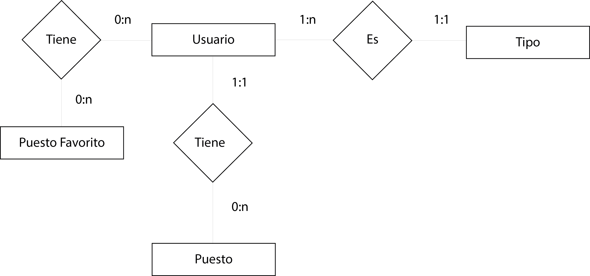 
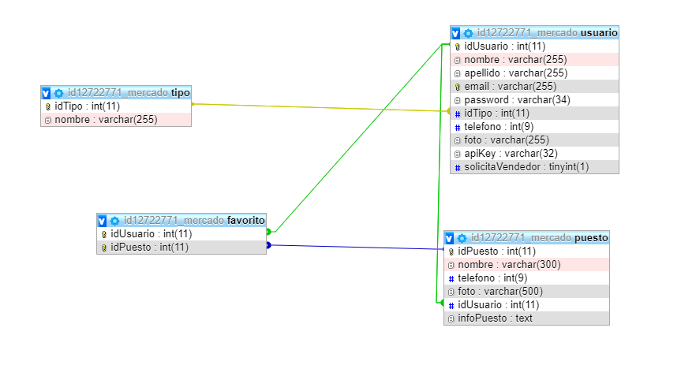 

